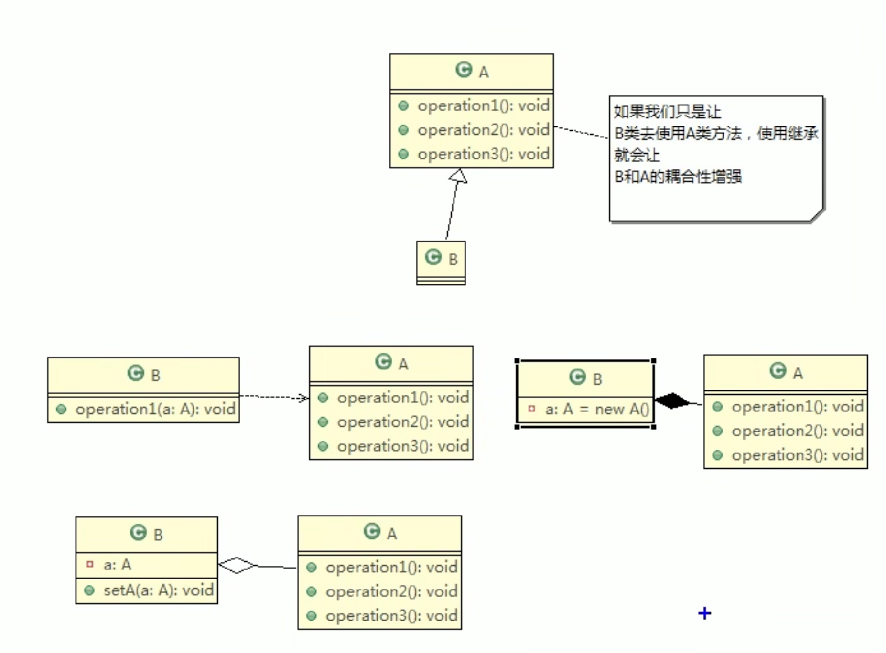
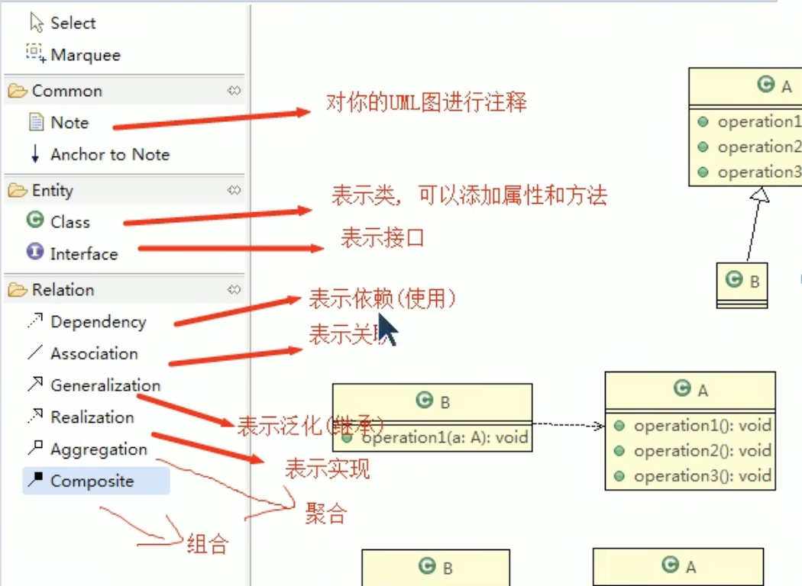
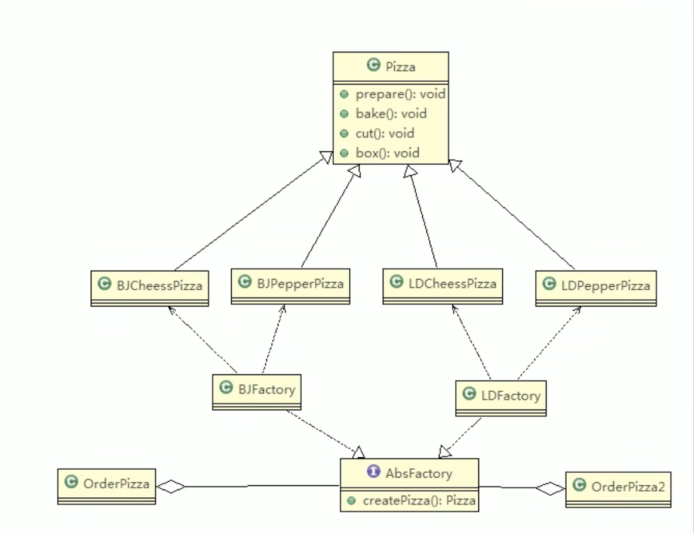

# 设计模式

* 什么是设计模式？

  设计模式共计23种，是在软件工程实践过程中，不同业务场景具有一些**共性问题**，而设计模式就是解决这些共性问题的一种**最佳实践**，可提升程序的可扩展性、可读性、可维护性等。

  这些解决方案是众多软件开发人员经过长时间的经验和试错总结出来的。

* 设计模式的目的

  写出健壮（可维护性、可扩展性、灵活性、重用性、可靠性）的程序，降低代码的耦合性，提升内聚性。

# 软件开发原则

23种设计模式是根据7大原则设计实现的，这些原则也是编程时应遵循的原则：

（1）单一职责原则

（2）接口隔离原则

（3）依赖倒置原则

（4）里氏替换原则

（5）开闭原则

（6）迪米特原则

（7）合成复用原则

## 单一职责原则

1）一个类只负责一项职责，降低类的复杂度

2）提升代码的可维护性、可读性

3）降低变更可能带来的风险

4）通常在类级别遵循单一职责原则，若逻辑简单，且类中方法较少，可在方法级别遵循单一职责原则

## 接口隔离原则

一个类通过接口依赖另一个类，应当建立在**最小的接口**上。

即被依赖的类只实现所需要的方法，避免冗余的方法实现。

## 依赖倒置原则

* 基本介绍

  1）高层模块不应依赖底层模块

  2）**抽象不应依赖细节，细节应该依赖抽象**

  3）依赖倒置的核心思想是**面向接口**编程

  4）依赖倒置原则基于设计理念：细节具有多变性，抽象具有稳定性，以抽象为基础搭建的框架比用细节搭建更稳定。Java中抽象指接口、抽象类，细节指具体的实现类。

  5）使用接口或抽象类的目的是制定好规范，而不涉及任何具体的操作，把展现细节的任务交给他们的实现类去完成。

* 依赖关系传递的三种方式

  a.接口实现

  b.构造方法

  c.setter方法

* 依赖倒置的注意细节

  1）底层模块尽量都有接口或抽象类，程序稳定性好。

  2）变量的声明尽量是抽象类或接口，可以使得变量引用和实际对象间存在一个缓冲层，利于程序扩展和优化。

  3）继承时遵循里氏替换原则。

  

## 里氏替换原则

1）程序中所有引用基类的地方，必须能透明地替换为其子类的对象，也就是子类尽量不要重写父类的方法。

2）继承使两个类间的耦合度高，适当情况下可通过依赖、聚合、组合来替换继承。

## 开闭原则

1）开闭原则是编程中**最基础、最重要**的设计原则

2）一个软件实体，如类、模块和函数应该对扩展开放（对功能的提供方），对修改关闭（对功能的使用方）。用抽象构建框架，用实现扩展细节。

3）当软件需要变化时，尽量通过扩展软件实体的行为来实现变化，而不是通过修改已有的代码来实现变化。

4）编程中遵循其他原则，以及使用设计模式的目的就是遵循开闭原则ocp。

## 迪米特原则

1）一个对象应对其他对象保持最少的了解。

2）类与类关系越密切，耦合度越大。

3）迪米特原则又称**最少知道原则**，即A类依赖B类，A类对B类知道的越少越好。被依赖的类不管多复杂，都尽量将逻辑封装在类内部，只对外提供public方法，除此外不透漏任何信息。

4）迪米特原则可概括为：**只与直接朋友通信**。

5）直接朋友：两个对象之间有耦合关系，就称这两个对象是朋友关系，例如A类依赖B类，则A类对象与B类对象是朋友关系。当A类中**成员属性有B类对象**、**成员方法的返回值有B类对象**或者**成员方法的参数有B类对象**，则B类是A类的直接朋友。也就是被依赖的B类，最好不要以局部变量的形式出现在A类成员方法的方法体中。

## 合成复用原则

尽量使用**合成/聚合**的方式，而不是使用**继承**的方式实现代码的复用。

# UML类图

统一建模语言UML是一种用于软件系统分析和设计的语言工具，帮助软件开发人员进行思考和记录思路，描述软件模型中的各个元素和他们之间的关系。

* 什么是UML类图？

  1）用于描述系统中的类（对象）本身的组成和类（对象）之间的各种静态关系。

  2）类之间的关系：依赖、泛化（继承）、实现、关联、聚合、组合。

## 类与类之间的6种关系

### 依赖

A类可通过4种方式依赖B类。

### 泛化（继承）

继承是特殊的依赖关系。

### 实现

实现是特殊的依赖关系。

### 关联

关联特殊的依赖关系。

### 聚合

聚合是特殊的关联关系。

成员变量+setter方法

B b;

Setter(){this.b = new B();}

创建A类的对象时，没创建B类对象，整体与部分的关系，部分能缺少。

### 组合

组合是特殊的关联关系。

成员变量+new关键字 

B b = new B();

创建A类的对象同时创建了B类对象，整体与部分的关系，部分不能缺少。

# 设计模式的分类

设计模式分三类

* 创建型模式：**单例模式**、**工厂模式**、原型模式、建造者模式、抽象工厂模式
* 结构型模式：适配器模式、桥接模式、**装饰模式**、组合模式、外观模式、享元模式、**代理模式**
* 行为型模式：模版方法模式、命令模式、访问者模式、迭代器模式、**观察者模式**、中介者模式、备忘录模式、解释器模式、状态模式、策略模式、责任链模式

## 创建型模式

### 单例模式

### 工厂模式

#### 要点

1）工厂模式提供了一种创建对象的方式，使得**对象的创建过程与对象的使用过程分离**，且**无需指定要创建的具体类**。

2）通过工厂模式，可以**将对象的创建逻辑封装在一个工厂类中**，而不是在客户端代码中直接实例化对象，这样可提高代码的可扩展性和可维护性。

3）工厂模式包括简单工厂模式、工厂方法模式、抽象工厂模式。

* 简单工厂模式：工厂模式的基础，使用一个单独的工厂类创建不同的对象，根据传入的参数确定对象的种类。

* 工厂方法模式：定义了一个创建对象的接口，但由子类决定实例化哪个类。工厂方法将对象的创建延迟到子类。

* 抽象工厂模式：拆分为2层，第一层为接口，负责搭建框架；第二层为实现类，负责具体的细节实现。 **将创建对象（实例化）任务下放到具体的实现类**。抽象工厂提供一个抽象接口，用于创建一系列相关或相互依赖的对象，而无需指定它们具体的类。

  第一层：抽象接口 AbsFactory，将实例化任务下放，不关心对象种类，只向使用者（客户端）提供对象。

  第二层：实现了接口的工厂子类BJFactory等，负责创建各种对象，只关心对象的种类和创建。

  与传统方式相比，虽然类的数量增多，但当新增对象的种类时，客户端旧代码不用修改，只需新增工厂子类，满足OCP原则，即对扩展开放，对修改关闭。

#### 使用场景

在不同条件下创建不同实例。

具体case

1. **日志记录**：日志可能记录到本地硬盘、系统事件、远程服务器等，用户可以选择记录日志的位置。
2. **数据库访问**：当用户不知道最终系统使用哪种数据库，或者数据库可能变化时。
3. **连接服务器的框架设计**：需要支持 "POP3"、"IMAP"、"HTTP" 三种协议，可以将这三种协议作为产品类，共同实现一个接口。

#### 工厂模式的主要角色

- 抽象产品（Abstract Product）：定义了产品的共同接口或抽象类。它可以是具体产品类的父类或接口，规定了产品对象的共同方法。
- 具体产品（Concrete Product）：实现了抽象产品接口，定义了具体产品的特定行为和属性。
- 抽象工厂（Abstract Factory）：声明了创建产品的抽象方法，可以是接口或抽象类。它可以有多个方法用于创建不同类型的产品。
- 具体工厂（Concrete Factory）：实现了抽象工厂接口，负责实际创建具体产品的对象。

#### JDK Canlendar源码分析

## 结构型模式

## 行为型模式

