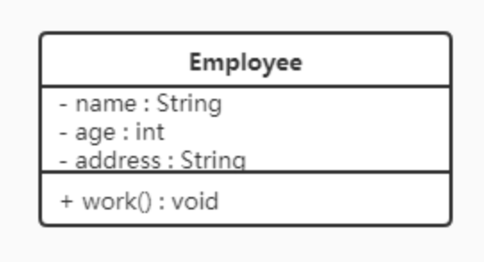
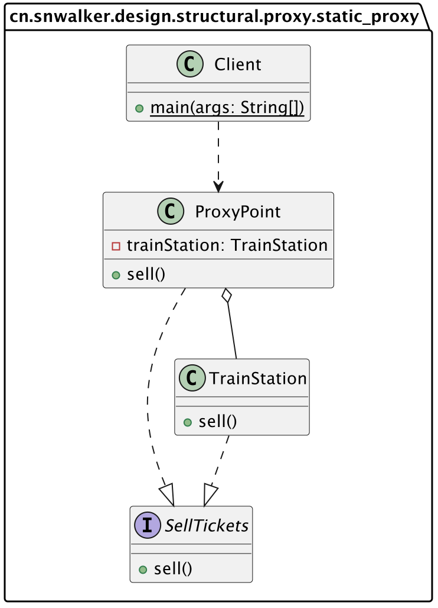

# 设计模式

* 什么是设计模式？

  设计模式共计23种，是在软件工程实践过程中，不同业务场景具有一些**共性问题**，而设计模式就是解决这些共性问题的一种**最佳实践**，可提升程序的可扩展性、可读性、可维护性等。这些解决方案是众多软件开发人员经过长时间的经验和试错总结出来的。

* 设计模式的目的

  写出健壮（可维护性、可扩展性、灵活性、重用性、可靠性）的程序，降低代码的耦合性，提升内聚性。

# 软件开发原则

23种设计模式是根据7大原则设计实现的，这些原则也是编程时应遵循的原则：

（1）单一职责原则

（2）接口隔离原则

（3）依赖倒置原则

（4）里氏替换原则

（5）开闭原则

（6）迪米特原则

（7）合成复用原则

## 单一职责原则

1）一个类只负责一项职责，降低类的复杂度

2）提升代码的可维护性、可读性

3）降低变更可能带来的风险

4）通常在类级别遵循单一职责原则，若逻辑简单，且类中方法较少，可在方法级别遵循单一职责原则

## 接口隔离原则

一个类通过接口依赖另一个类，应当建立在**最小的接口**上。

即被依赖的类只实现所需要的方法，避免冗余的方法实现。


## 依赖倒置原则

* 基本介绍

  1）高层模块不应依赖底层模块

  2）**抽象不应依赖细节，细节应该依赖抽象**

  3）依赖倒置的核心思想是**面向接口**编程

  4）依赖倒置原则基于设计理念：细节具有多变性，抽象具有稳定性，以抽象为基础搭建的框架比用细节搭建更稳定。Java中抽象指接口、抽象类，细节指具体的实现类。

  5）使用接口或抽象类的目的是制定好规范，而不涉及任何具体的操作，把展现细节的任务交给他们的实现类去完成。

* 依赖关系传递的三种方式

  a.接口实现

  b.构造方法

  c.setter方法

* 依赖倒置的注意细节

  1）底层模块尽量都有接口或抽象类，程序稳定性好。

  2）变量的声明尽量是抽象类或接口，可以使得变量引用和实际对象间存在一个缓冲层，利于程序扩展和优化。

  3）继承时遵循里氏替换原则。

  

## 里氏替换原则

1）程序中所有引用基类的地方，必须能透明地替换为其子类的对象，也就是子类尽量不要重写父类的方法。

2）继承使两个类间的耦合度高，适当情况下可通过依赖、聚合、组合来替换继承。


## 开闭原则

1）开闭原则是编程中**最基础、最重要**的设计原则

2）一个软件实体，如类、模块和函数应该对扩展开放（对功能的提供方），对修改关闭（对功能的使用方）。用抽象构建框架，用实现扩展细节。

3）当软件需要变化时，尽量通过扩展软件实体的行为来实现变化，而不是通过修改已有的代码来实现变化。

4）编程中遵循其他原则，以及使用设计模式的目的就是遵循开闭原则ocp。


## 迪米特法则

1）一个对象应对其他对象保持最少的了解。

2）类与类关系越密切，耦合度越大。

3）迪米特原则又称**最少知道原则**，即A类依赖B类，A类对B类知道的越少越好。被依赖的类不管多复杂，都尽量将逻辑封装在类内部，只对外提供public方法，除此外不透漏任何信息。

4）迪米特原则可概括为：**只与直接朋友通信**。

5）直接朋友：两个对象之间有耦合关系，就称这两个对象是朋友关系，例如A类依赖B类，则A类对象与B类对象是朋友关系。当A类中**成员属性有B类对象**、**成员方法的返回值有B类对象**或者**成员方法的参数有B类对象**，则B类是A类的直接朋友。也就是被依赖的B类，最好不要以局部变量的形式出现在A类成员方法的方法体中。


## 合成复用原则

尽量使用**合成/聚合**的方式，而不是使用**继承**的方式实现代码的复用。


# UML类图

统一建模语言UML是一种用于软件系统分析和设计的语言工具，帮助软件开发人员进行思考和记录思路，描述软件模型中的各个元素和他们之间的关系。它的特点是简单、统一、图形化、能表达软件设计中的动态与静态信息。

UML 从目标系统的不同角度出发，定义了用例图、类图、对象图、状态图、活动图、时序图、协作图、构件图、部署图等 9 种图。


* 什么是UML类图？

  1）用于描述系统中的类（对象）本身的组成和类（对象）之间的各种静态关系。

  2）类之间的关系：依赖、泛化（继承）、实现、关联、聚合、组合。

* 类的表示方式

  在UML类图中，类使用包含类名、属性(field) 和方法(method) 且带有分割线的矩形来表示，比如下图表示一个Employee类，它包含name,age和address这3个属性，以及work()方法。 

  

  属性/方法名称前加的加号和减号表示了这个属性/方法的可见性，UML类图中表示可见性的符号有三种：

  * +：表示public

  * -：表示private

  * #：表示protected

  属性的完整表示方式是： **可见性  名称 ：类型 [ = 缺省值]**  

  方法的完整表示方式是： **可见性  名称(参数列表) [ ： 返回类型]**

  > 注意：
  >
  > ​	1.中括号中的内容表示是可选的
  >
  > ​	2.也有将类型放在变量名前面，返回值类型放在方法名前面


## 类与类之间的6种关系

### 1、依赖

A类可通过4种方式依赖B类。


### 2、泛化（继承）

继承是特殊的依赖关系。


### 3、实现

实现是特殊的依赖关系。


### 4、关联

关联特殊的依赖关系。


### 5、聚合

聚合是特殊的关联关系。

成员变量+setter方法

B b;

Setter(){this.b = new B();}

创建A类的对象时，没创建B类对象，整体与部分的关系，部分能缺少。


### 6、组合

组合是特殊的关联关系。

成员变量+new关键字 

B b = new B();

创建A类的对象同时创建了B类对象，整体与部分的关系，部分不能缺少。


# 设计模式的分类

设计模式分三类

* 创建型模式：**单例模式**、**工厂模式**、原型模式、建造者模式、抽象工厂模式
* 结构型模式：适配器模式、桥接模式、**装饰模式**、组合模式、外观模式、享元模式、**代理模式**
* 行为型模式：模版方法模式、命令模式、访问者模式、迭代器模式、**观察者模式**、中介者模式、备忘录模式、解释器模式、状态模式、策略模式、责任链模式

## 创建型模式

### 1、单例模式

单例模式（Singleton Pattern）是最简单的设计模式之一，它提供了一种创建对象的最佳方式。

这种模式涉及到一个单一的类，该类负责创建自己**唯一**的对象。这个类提供了一种访问其唯一的对象的方式，可以直接访问，不需要实例化该类的对象。

#### 1.1 单例模式的结构

单例模式主要包括2个角色：

* 单例类。只能创建一个对象。
* 访问类。使用单例类。

#### 1.2 单例模式的实现

饿汉式：**类加载**就会**创建**该类的单实例，存在内存资源浪费。

懒汉式：类加载不会导致该单实例对象被创建，而是**首次使用**该对象时才会**创建**。

恶汉式：利用枚举特性实现单例模式。

1. 饿汉式-方式1（静态变量方式）

   ```java
   /**
    * 饿汉式
    *      静态变量创建类的对象
    */
   public class Singleton {
       //私有构造方法
       private Singleton() {}
   
       //在成员位置创建该类的对象
       private static Singleton instance = new Singleton();
   
       //对外提供静态方法获取该对象
       public static Singleton getInstance() {
           return instance;
       }
   }
   ```

   <font color='red'>说明：</font>

   ​	该方式在成员位置声明Singleton类型的静态变量，并创建Singleton类的对象instance。instance对象是随着类的加载而创建的。如果该对象足够大的话，而一直没有使用就会造成内存的浪费。

   

2. 饿汉式-方式2（静态代码块方式）

   ```java
   /**
    * 恶汉式
    *      在静态代码块中创建该类对象
    */
   public class Singleton {
   
       //私有构造方法
       private Singleton() {}
   
       //在成员位置创建该类的对象
       private static Singleton instance;
   
       static {
           instance = new Singleton();
       }
   
       //对外提供静态方法获取该对象
       public static Singleton getInstance() {
           return instance;
       }
   }
   ```

   <font color='red'>说明：</font>

   ​	该方式在成员位置声明Singleton类型的静态变量，而对象的创建是在静态代码块中，也是对着类的加载而创建。所以和饿汉式的方式1基本上一样，当然该方式也存在内存浪费问题。

   

3. 懒汉式-方式1（线程不安全）

   ```java
   /**
    * 懒汉式
    *  线程不安全
    */
   public class Singleton {
       //私有构造方法
       private Singleton() {}
   
       //在成员位置创建该类的对象
       private static Singleton instance;
   
       //对外提供静态方法获取该对象
       public static Singleton getInstance() {
   
           if(instance == null) {
               instance = new Singleton();
           }
           return instance;
       }
   }
   ```

   <font color='red'>说明：</font>

   ​	从上面代码我们可以看出该方式在成员位置声明Singleton类型的静态变量，并没有进行对象的赋值操作，那么什么时候赋值的呢？当调用getInstance()方法获取Singleton类的对象的时候才创建Singleton类的对象，这样就实现了懒加载的效果。但是，如果是多线程环境，会出现线程安全问题。

   

4. 懒汉式-方式2（线程安全）

   ```java
   /**
    * 懒汉式
    *  线程安全
    */
   public class Singleton {
       //私有构造方法
       private Singleton() {}
   
       //在成员位置创建该类的对象
       private static Singleton instance;
   
       //对外提供静态方法获取该对象
       public static synchronized Singleton getInstance() {
   
           if(instance == null) {
               instance = new Singleton();
           }
           return instance;
       }
   }
   ```

   <font color='red'>说明：</font>

   ​	该方式也实现了懒加载效果，同时又解决了线程安全问题。但是在getInstance()方法上添加了synchronized关键字，导致该方法的执行效果特别低。从上面代码我们可以看出，其实就是在初始化instance的时候才会出现线程安全问题，一旦初始化完成就不存在了。

   

5. 懒汉式-方式3（双重检查锁）

   再来讨论一下懒汉模式中加锁的问题，对于 `getInstance()` 方法来说，绝大部分的操作都是读操作，读操作是线程安全的，所以我们没必让每个线程必须持有锁才能调用该方法，我们需要调整加锁的时机。由此也产生了一种新的实现模式：双重检查锁模式

   ```java
   /**
    * 双重检查方式
    */
   public class Singleton { 
   
       //私有构造方法
       private Singleton() {}
   
       private static Singleton instance;
   
      //对外提供静态方法获取该对象
       public static Singleton getInstance() {
   		//第一次判断，如果instance不为null，不进入抢锁阶段，直接返回实例
           if(instance == null) {
               synchronized (Singleton.class) {
                   //抢到锁之后再次判断是否为null
                   if(instance == null) {
                       instance = new Singleton();
                   }
               }
           }
           return instance;
       }
   }
   ```

   双重检查锁模式是一种非常好的单例实现模式，解决了单例、性能、线程安全问题，上面的双重检测锁模式看上去完美无缺，其实是存在问题，在多线程的情况下，可能会出现空指针问题，出现问题的原因是JVM在实例化对象的时候会进行优化和指令重排序操作。

   要解决双重检查锁模式带来空指针异常的问题，只需要使用 `volatile` 关键字, `volatile` 关键字可以保证可见性和有序性。

   ```java
   /**
    * 双重检查方式
    */
   public class Singleton {
   
       //私有构造方法
       private Singleton() {}
   
       private static volatile Singleton instance;
   
      //对外提供静态方法获取该对象
       public static Singleton getInstance() {
   		//第一次判断，如果instance不为null，不进入抢锁阶段，直接返回实际
           if(instance == null) {
               synchronized (Singleton.class) {
                   //抢到锁之后再次判断是否为空
                   if(instance == null) {
                       instance = new Singleton();
                   }
               }
           }
           return instance;
       }
   }
   ```

   <font color="red">小结：</font>

   添加 `volatile` 关键字之后的双重检查锁模式是一种比较好的单例实现模式，能够保证在多线程的情况下线程安全也不会有性能问题。


6. 懒汉式-方式4（静态内部类方式）

   静态内部类单例模式中实例由内部类创建，由于 JVM 在加载外部类的过程中, 是不会加载静态内部类的, 只有内部类的属性/方法被调用时才会被加载, 并初始化其静态属性。静态属性由于被 `static` 修饰，保证只被实例化一次，并且严格保证实例化顺序。

   ```java
   /**
    * 静态内部类方式
    */
   public class Singleton {
   
       //私有构造方法
       private Singleton() {}
   
       private static class SingletonHolder {
           private static final Singleton INSTANCE = new Singleton();
       }
   
       //对外提供静态方法获取该对象
       public static Singleton getInstance() {
           return SingletonHolder.INSTANCE;
       }
   }
   ```

   <font color='red'>说明：</font>

   ​	第一次加载Singleton类时不会去初始化INSTANCE，只有第一次调用getInstance，虚拟机加载SingletonHolder

   并初始化INSTANCE，这样不仅能确保线程安全，也能保证 Singleton 类的唯一性。

   <font color="red">小结：</font>

   ​	静态内部类单例模式是一种优秀的单例模式，是开源项目中比较常用的一种单例模式。在没有加任何锁的情况下，保证了多线程下的安全，并且没有任何性能影响和空间的浪费。

   

7. 枚举方式

   枚举类实现单例模式是极力推荐的单例实现模式，因为枚举类型是线程安全的，并且只会装载一次，设计者充分的利用了枚举的这个特性来实现单例模式，枚举的写法非常简单，而且枚举类型是所用单例实现中唯一一种不会被破坏的单例实现模式。

   ```java
   /**
    * 枚举方式
    */
   public enum Singleton {
       INSTANCE;
   }
   ```


#### 1.3 问题演示

破坏单例模式：

使上面定义的单例类（Singleton）可以创建多个对象，枚举方式除外。有两种方式，分别是序列化和反射。

* 序列化反序列化

  **Singleton类：**

  ```java
  public class Singleton implements Serializable {
  
      //私有构造方法
      private Singleton() {}
  
      private static class SingletonHolder {
          private static final Singleton INSTANCE = new Singleton();
      }
  
      //对外提供静态方法获取该对象
      public static Singleton getInstance() {
          return SingletonHolder.INSTANCE;
      }
  }
  ```

  **Test类：**

  ```java
  public class Test {
      public static void main(String[] args) throws Exception {
          //往文件中写对象
          //writeObject2File();
          //从文件中读取对象
          Singleton s1 = readObjectFromFile();
          Singleton s2 = readObjectFromFile();
  
          //判断两个反序列化后的对象是否是同一个对象
          System.out.println(s1 == s2);
      }
  
      private static Singleton readObjectFromFile() throws Exception {
          //创建对象输入流对象
          ObjectInputStream ois = new ObjectInputStream(new FileInputStream("C:\\Users\\Think\\Desktop\\a.txt"));
          //第一个读取Singleton对象
          Singleton instance = (Singleton) ois.readObject();
  
          return instance;
      }
  
      public static void writeObject2File() throws Exception {
          //获取Singleton类的对象
          Singleton instance = Singleton.getInstance();
          //创建对象输出流
          ObjectOutputStream oos = new ObjectOutputStream(new FileOutputStream("C:\\Users\\Think\\Desktop\\a.txt"));
          //将instance对象写出到文件中
          oos.writeObject(instance);
      }
  }
  ```

  > 上面代码运行结果是`false`，表明序列化和反序列化已经破坏了单例设计模式。

* 反射

  **Singleton类：**

  ```java
  public class Singleton {
  
      //私有构造方法
      private Singleton() {}
      
      private static volatile Singleton instance;
  
      //对外提供静态方法获取该对象
      public static Singleton getInstance() {
  
          if(instance != null) {
              return instance;
          }
  
          synchronized (Singleton.class) {
              if(instance != null) {
                  return instance;
              }
              instance = new Singleton();
              return instance;
          }
      }
  }
  ```

  **Test类：**

  ```java
  public class Test {
      public static void main(String[] args) throws Exception {
          //获取Singleton类的字节码对象
          Class clazz = Singleton.class;
          //获取Singleton类的私有无参构造方法对象
          Constructor constructor = clazz.getDeclaredConstructor();
          //取消访问检查
          constructor.setAccessible(true);
  
          //创建Singleton类的对象s1
          Singleton s1 = (Singleton) constructor.newInstance();
          //创建Singleton类的对象s2
          Singleton s2 = (Singleton) constructor.newInstance();
  
          //判断通过反射创建的两个Singleton对象是否是同一个对象
          System.out.println(s1 == s2);
      }
  }
  ```

  > 上面代码运行结果是`false`，表明序列化和反序列化已经破坏了单例设计模式

> <font color="red">注意：</font>枚举方式不会出现这两个问题。


#### 1.4 问题的解决

* 序列化、反序列方式破坏单例模式的解决方法

  在Singleton类中添加`readResolve()`方法，在反序列化时被反射调用，如果定义了这个方法，就返回这个方法的值，如果没有定义，则返回新new出来的对象。

  **Singleton类：**

  ```java
  public class Singleton implements Serializable {
  
      //私有构造方法
      private Singleton() {}
  
      private static class SingletonHolder {
          private static final Singleton INSTANCE = new Singleton();
      }
  
      //对外提供静态方法获取该对象
      public static Singleton getInstance() {
          return SingletonHolder.INSTANCE;
      }
      
      /**
       * 下面是为了解决序列化反序列化破解单例模式
       */
      private Object readResolve() {
          return SingletonHolder.INSTANCE;
      }
  }
  ```

  **源码解析：**

  ObjectInputStream类

  ```java
  public final Object readObject() throws IOException, ClassNotFoundException{
      ...
      // if nested read, passHandle contains handle of enclosing object
      int outerHandle = passHandle;
      try {
          Object obj = readObject0(false);//重点查看readObject0方法
      .....
  }
      
  private Object readObject0(boolean unshared) throws IOException {
  	...
      try {
  		switch (tc) {
  			...
  			case TC_OBJECT:
  				return checkResolve(readOrdinaryObject(unshared));//重点查看readOrdinaryObject方法
  			...
          }
      } finally {
          depth--;
          bin.setBlockDataMode(oldMode);
      }    
  }
      
  private Object readOrdinaryObject(boolean unshared) throws IOException {
  	...
  	//isInstantiable 返回true，执行 desc.newInstance()，通过反射创建新的单例类，
      obj = desc.isInstantiable() ? desc.newInstance() : null; 
      ...
      // 在Singleton类中添加 readResolve 方法后 desc.hasReadResolveMethod() 方法执行结果为true
      if (obj != null && handles.lookupException(passHandle) == null && desc.hasReadResolveMethod()) {
      	// 通过反射调用 Singleton 类中的 readResolve 方法，将返回值赋值给rep变量
      	// 这样多次调用ObjectInputStream类中的readObject方法，继而就会调用我们定义的readResolve方法，所以返回的是同一个对象。
      	Object rep = desc.invokeReadResolve(obj);
       	...
      }
      return obj;
  }
  ```

* 反射方式破解单例的解决方法

  ```java
  public class Singleton {
  
      //私有构造方法
      private Singleton() {
          /*
             反射破解单例模式需要添加的代码
          */
          if(instance != null) {
              throw new RuntimeException();
          }
      }
      
      private static volatile Singleton instance;
  
      //对外提供静态方法获取该对象
      public static Singleton getInstance() {
  
          if(instance != null) {
              return instance;
          }
  
          synchronized (Singleton.class) {
              if(instance != null) {
                  return instance;
              }
              instance = new Singleton();
              return instance;
          }
      }
  }
  ```

  <font color="red">说明:</font>

  ​	这种方式比较好理解。当通过反射方式调用构造方法进行创建创建时，直接抛异常。不运行此中操作。


#### 1.5 JDK源码解析-Runtime类

Runtime类就是使用的单例设计模式。

1. 通过源代码查看使用的是哪儿种单例模式

   ```java
   public class Runtime {
       private static Runtime currentRuntime = new Runtime();
   
       /**
        * Returns the runtime object associated with the current Java application.
        * Most of the methods of class <code>Runtime</code> are instance
        * methods and must be invoked with respect to the current runtime object.
        *
        * @return  the <code>Runtime</code> object associated with the current
        *          Java application.
        */
       public static Runtime getRuntime() {
           return currentRuntime;
       }
   
       /** Don't let anyone else instantiate this class */
       private Runtime() {}
       ...
   }
   ```

   从上面源代码中可以看出Runtime类使用的是恶汉式（静态属性）方式来实现单例模式的。

   

2. 使用Runtime类中的方法

   ```java
   public class RuntimeDemo {
       public static void main(String[] args) throws IOException {
           //获取Runtime类对象
           Runtime runtime = Runtime.getRuntime();
   
           //返回 Java 虚拟机中的内存总量。
           System.out.println(runtime.totalMemory());
           //返回 Java 虚拟机试图使用的最大内存量。
           System.out.println(runtime.maxMemory());
   
           //创建一个新的进程执行指定的字符串命令，返回进程对象
           Process process = runtime.exec("ipconfig");
           //获取命令执行后的结果，通过输入流获取
           InputStream inputStream = process.getInputStream();
           byte[] arr = new byte[1024 * 1024* 100];
           int b = inputStream.read(arr);
           System.out.println(new String(arr,0,b,"gbk"));
       }
   }
   ```

   


### 2、工厂模式

#### 要点

1）工厂模式提供了一种创建对象的方式，使得**对象的创建过程与对象的使用过程分离**，且**无需指定要创建的具体类**。

2）通过工厂模式，可以**将对象的创建逻辑封装在一个工厂类中**，而不是在客户端代码中直接实例化对象，这样可提高代码的可扩展性和可维护性。

3）工厂模式包括简单工厂模式、工厂方法模式、抽象工厂模式。

* 简单工厂模式：工厂模式的基础，使用一个单独的工厂类创建不同的对象，根据传入的参数确定对象的种类。

* 工厂方法模式：定义了一个创建对象的接口，但由子类决定实例化哪个类。工厂方法将对象的创建延迟到子类。

* 抽象工厂模式：拆分为2层，第一层为接口，负责搭建框架；第二层为实现类，负责具体的细节实现。 **将创建对象（实例化）任务下放到具体的实现类**。抽象工厂提供一个抽象接口，用于创建一系列相关或相互依赖的对象，而无需指定它们具体的类。

  第一层：抽象接口 AbsFactory，将实例化任务下放，不关心对象种类，只向使用者（客户端）提供对象。

  第二层：实现了接口的工厂子类BJFactory等，负责创建各种对象，只关心对象的种类和创建。

  与传统方式相比，虽然类的数量增多，但当新增对象的种类时，客户端旧代码不用修改，只需新增工厂子类，满足OCP原则，即对扩展开放，对修改关闭。


#### 使用场景

在不同条件下创建不同实例。

具体case

1. **日志记录**：日志可能记录到本地硬盘、系统事件、远程服务器等，用户可以选择记录日志的位置。
2. **数据库访问**：当用户不知道最终系统使用哪种数据库，或者数据库可能变化时。
3. **连接服务器的框架设计**：需要支持 "POP3"、"IMAP"、"HTTP" 三种协议，可以将这三种协议作为产品类，共同实现一个接口。

#### 工厂模式的主要角色

- 抽象产品（Abstract Product）：定义了产品的共同接口或抽象类。它可以是具体产品类的父类或接口，规定了产品对象的共同方法。
- 具体产品（Concrete Product）：实现了抽象产品接口，定义了具体产品的特定行为和属性。
- 抽象工厂（Abstract Factory）：声明了创建产品的抽象方法，可以是接口或抽象类。它可以有多个方法用于创建不同类型的产品。
- 具体工厂（Concrete Factory）：实现了抽象工厂接口，负责实际创建具体产品的对象。


#### JDK Canlendar源码分析


## 结构型模式

结构型模式将类和对象按某种布局组成更大的结构，分为类结构型模式和对象结构型模式。

* 类结构型模式：采用**继承**机制来组织接口和类。

* 对象结构型模式：采用**聚合或组合**来组合对象。

由于聚合关系或组合关系比继承关系耦合度低，遵循了“合成复用原则”，所以对象结构型模式比类结构型模式具有更大的灵活性。

### 1、代理模式

#### 1.1 概述

**访问对象**不适合或者不能直接引用**目标对象**时，通过一个**代理对象**作为中介，来**控制**对目标对象的访问。

Java中根据代理类生成的时机，代理分为如下两类：

静态代理：在**编译**阶段生成。

动态代理：在**Java运行时**动态生成，包括**JDK代理**和**CGLib代理**两种。

#### 1.2 结构

代理模式（Proxy）有三种角色：

* 抽象主题（Subject）类： 通过接口或抽象类声明真实主题和代理对象实现的业务方法。
* 真实主题（Real Subject）类： 实现了抽象主题中的具体业务，是代理对象所代表的真实对象，是最终要引用的对象。
* 代理（Proxy）类 ： 提供了与真实主题相同的接口，其内部含有对真实主题的引用，它可以访问、控制或扩展真实主题的功能。

#### 1.3 静态代理

【例】火车站卖票

如果要买火车票的话，需要去火车站买票，坐车到火车站，排队等一系列的操作，显然比较麻烦。而火车站在多个地方都有代售点，我们去代售点买票就方便很多了。这个例子其实就是典型的代理模式，火车站是目标对象，代售点是代理对象。类图如下：



代码：

```java
/**
 * 卖票接口
 */
public interface SellTickets {
    public void sell();
}

/**
 * 火车站（目标类） 具有卖票功能，实现SellTickets接口。
 */
public class TrainStation implements SellTickets{
    public void sell() {
        System.out.println("火车站卖票");
    }
}

/**
 * 代理点（代理类） 通过代理对象间接访问目标对象，控制访问。
 */
public class ProxyPoint {
    private TrainStation trainStation = new TrainStation();
    public void sell() {
        System.out.println("代理点收取一定的服务费"); // 增强目标对象的sell()方法。
        trainStation.sell();
    }
}

/**
 * 客户端（访问类）
 */
public class Client {
    public static void main(String[] args) {
        ProxyPoint proxyPoint = new ProxyPoint();
        proxyPoint.sell();
    }
}
```

客户端直接访问代理类ProxyPoint的对象，间接地访问目标类TrainStation的对象，并对sell()方法进行了增强。

#### 1.4 JDK动态代理

Java提供了一个动态代理类java.lang.reflect.**Proxy**，该类并不是代理对象的类，而是提供了一个创建代理对象的静态方法**newProxyInstance()**来获取代理对象。

代码：

```java
/**
 * 卖票接口（抽象主题类）
 */
public interface SellTickets {
    public void sell();
}

/**
 * 火车站（真实主题类） 具有卖票功能，实现SellTickets接口。
 */
public class TrainStation implements SellTickets {
    public void sell() {
        System.out.println("火车站卖票");
    }
}

/**
 * 代理工厂（并不是代理对象的类，只提供获取代理对象的方法）
 */
public class ProxyFactory {
    private TrainStation trainStation = new TrainStation();

    // 获取代理对象
    public SellTickets getProxyObject() {
        // 使用动态代理类Proxy提供的方法获取代理对象
        /*
            newProxyInstance()方法参数说明：
            ClassLoader loader ： 类加载器，用于加载代理类，使用真实对象的类加载器即可
            Class<?>[] interfaces ： 真实对象所实现的接口，代理模式真实对象和代理对象实现相同的接口
            InvocationHandler h ： 代理对象的调用处理程序
         */
        SellTickets proxyObject = (SellTickets) Proxy.newProxyInstance(
                trainStation.getClass().getClassLoader(),
                trainStation.getClass().getInterfaces(),
                new InvocationHandler() {
                    /*
                        InvocationHandler中invoke方法参数说明：
                        proxy ： 代理对象
                        method ： 对应于在代理对象上调用的接口方法的 Method 实例
                        args ： 代理对象调用接口方法时传递的实际参数
                     */
                    @Override
                    public Object invoke(Object proxy, Method method, Object[] args) throws Throwable {
                        System.out.println("代理点收取一定的服务费（JDK动态代理方式）");
                        // 执行真实对象
                        Object result = method.invoke(trainStation, args);
                        return result;
                    }
                }
        );
        return proxyObject;
    }
}

/**
 * 客户端（访问类）
 */
public class Client {
    public static void main(String[] args) {
        // 获取代理对象
        ProxyFactory proxyFactory = new ProxyFactory();

        SellTickets proxyObject = proxyFactory.getProxyObject();
        proxyObject.sell();
    }
}
```

* **ProxyFactory是代理类吗**？

ProxyFactory不是代理模式中所说的代理类，而代理类是程序在运行过程中动态的在内存中生成的类。通过阿里巴巴开源的 Java 诊断工具（Arthas【阿尔萨斯】）查看代理类的结构：

```java
package com.sun.proxy;

package cn.snwalker.design.structural.proxy.JDK_proxy.SellTickets;
import java.lang.reflect.InvocationHandler;
import java.lang.reflect.Method;
import java.lang.reflect.Proxy;
import java.lang.reflect.UndeclaredThrowableException;

public final class $Proxy0 extends Proxy implements SellTickets {
    private static Method m1;
    private static Method m2;
    private static Method m3;
    private static Method m0;

    public $Proxy0(InvocationHandler invocationHandler) {
        super(invocationHandler);
    }

    static {
        try {
            m1 = Class.forName("java.lang.Object").getMethod("equals", Class.forName("java.lang.Object"));
            m2 = Class.forName("java.lang.Object").getMethod("toString", new Class[0]);
            m3 = Class.forName("com.itheima.proxy.dynamic.jdk.SellTickets").getMethod("sell", new Class[0]);
            m0 = Class.forName("java.lang.Object").getMethod("hashCode", new Class[0]);
            return;
        }
        catch (NoSuchMethodException noSuchMethodException) {
            throw new NoSuchMethodError(noSuchMethodException.getMessage());
        }
        catch (ClassNotFoundException classNotFoundException) {
            throw new NoClassDefFoundError(classNotFoundException.getMessage());
        }
    }

    public final boolean equals(Object object) {
        try {
            return (Boolean)this.h.invoke(this, m1, new Object[]{object});
        }
        catch (Error | RuntimeException throwable) {
            throw throwable;
        }
        catch (Throwable throwable) {
            throw new UndeclaredThrowableException(throwable);
        }
    }

    public final String toString() {
        try {
            return (String)this.h.invoke(this, m2, null);
        }
        catch (Error | RuntimeException throwable) {
            throw throwable;
        }
        catch (Throwable throwable) {
            throw new UndeclaredThrowableException(throwable);
        }
    }

    public final int hashCode() {
        try {
            return (Integer)this.h.invoke(this, m0, null);
        }
        catch (Error | RuntimeException throwable) {
            throw throwable;
        }
        catch (Throwable throwable) {
            throw new UndeclaredThrowableException(throwable);
        }
    }

    public final void sell() {
        try {
            this.h.invoke(this, m3, null);
            return;
        }
        catch (Error | RuntimeException throwable) {
            throw throwable;
        }
        catch (Throwable throwable) {
            throw new UndeclaredThrowableException(throwable);
        }
    }
}
```

从上面的类中，可以看到以下信息：

（1）代理类（$Proxy0）实现了SellTickets。印证了**真实类和代理类实现同样的接口**。

（2）代理类（$Proxy0）将我们提供的**匿名内部类对象传递给了父类**。

* **动态代理的执行流程**？

下面是摘取的重点代码：

```java
//程序运行过程中动态生成的代理类
public final class $Proxy0 extends Proxy implements SellTickets {
    private static Method m3;

    public $Proxy0(InvocationHandler invocationHandler) {
        super(invocationHandler);
    }

    static {
        m3 = Class.forName("com.itheima.proxy.dynamic.jdk.SellTickets").getMethod("sell", new Class[0]);
    }

    public final void sell() {
        this.h.invoke(this, m3, null);
    }
}

//Java提供的动态代理相关类
public class Proxy implements java.io.Serializable {
	protected InvocationHandler h;
	 
	protected Proxy(InvocationHandler h) {
        this.h = h;
    }
}

//代理工厂类
public class ProxyFactory {

    private TrainStation station = new TrainStation();

    public SellTickets getProxyObject() {
        SellTickets sellTickets = (SellTickets) Proxy.newProxyInstance(station.getClass().getClassLoader(),
                station.getClass().getInterfaces(),
                new InvocationHandler() {
                    
                    public Object invoke(Object proxy, Method method, Object[] args) throws Throwable {

                        System.out.println("代理点收取一些服务费用(JDK动态代理方式)");
                        Object result = method.invoke(station, args);
                        return result;
                    }
                });
        return sellTickets;
    }
}


//访问类
public class Client {
    public static void main(String[] args) {
        //获取代理对象
        ProxyFactory factory = new ProxyFactory();
        SellTickets proxyObject = factory.getProxyObject();
        proxyObject.sell();
    }
}
```

执行流程如下：

    1. 在访问类中通过代理对象调用sell()方法
    2. 根据多态的特性，执行的是代理类（$Proxy0）中的sell()方法
    3. 代理类（$Proxy0）中的sell()方法中又调用了InvocationHandler接口的子实现类对象的invoke方法
    4. invoke方法通过反射执行了真实对象所属类(TrainStation)中的sell()方法

#### 1.5 CGLIB动态代理

如果没有定义SellTickets接口，只定义了TrainStation(火车站类)。很显然JDK代理是无法使用了，因为**JDK动态代理要求必须定义接口，对接口进行代理**。

CGLIB是一个功能强大，高性能的代码生成包。它为没有实现接口的类提供代理，为JDK的动态代理提供了很好的补充。

CGLIB是第三方提供的包，所以需要引入jar包的坐标：

```xml
<dependency>
    <groupId>cglib</groupId>
    <artifactId>cglib</artifactId>
    <version>3.3.0</version>
</dependency>
问题：Java 17模块系统禁止cglib反射访问核心类。
方法：在运行配置的VM options中添加--add-opens java.base/java.lang=ALL-UNNAMED
```

代码：

```java
//火车站
public class TrainStation {
    public void sell() {
        System.out.println("火车站卖票");
    }
}

//代理工厂
public class ProxyFactory implements MethodInterceptor {
    private TrainStation target = new TrainStation();

    public TrainStation getProxyObject() {
        //创建Enhancer对象，类似于JDK动态代理的Proxy类，下一步就是设置几个参数
        Enhancer enhancer =new Enhancer();
        //设置父类的字节码对象
        enhancer.setSuperclass(target.getClass());
        //设置回调函数
        enhancer.setCallback(this);
        //创建代理对象
        TrainStation obj = (TrainStation) enhancer.create();
        return obj;
    }

    /*
        intercept方法参数说明：
            o ： 代理对象
            method ： 真实对象中的方法的Method实例
            args ： 实际参数
            methodProxy ：代理对象中的方法的method实例
     */
    public TrainStation intercept(Object o, Method method, Object[] args, MethodProxy methodProxy) throws Throwable {
        System.out.println("代理点收取一些服务费用(CGLIB动态代理方式)");
        TrainStation result = (TrainStation) methodProxy.invokeSuper(o, args);
        return result;
    }
}

//测试类
public class Client {
    public static void main(String[] args) {
        //创建代理工厂对象
        ProxyFactory factory = new ProxyFactory();
        //获取代理对象
        TrainStation proxyObject = factory.getProxyObject();

        proxyObject.sell();
    }
}
```

#### 1.6 三种代理的对比

* jdk代理和CGLIB代理

  使用CGLib实现动态代理，CGLib底层采用ASM字节码生成框架，使用字节码技术生成代理类，在JDK1.6之前比使用Java反射效率要高。唯一需要注意的是，CGLib不能对声明为final的类或者方法进行代理，因为CGLib原理是动态生成被代理类的子类。

  在JDK1.6、JDK1.7、JDK1.8逐步对JDK动态代理优化之后，在调用次数较少的情况下，JDK代理效率高于CGLib代理效率，只有当进行大量调用的时候，JDK1.6和JDK1.7比CGLib代理效率低一点，但是到JDK1.8的时候，JDK代理效率高于CGLib代理。所以如果有接口使用JDK动态代理，如果没有接口使用CGLIB代理。

* 动态代理和静态代理

  动态代理与静态代理相比较，最大的好处是接口中声明的所有方法都被转移到调用处理器一个集中的方法中处理（InvocationHandler.invoke）。这样，在接口方法数量比较多的时候，我们可以进行灵活处理，而不需要像静态代理那样每一个方法进行中转。

  如果接口增加一个方法，静态代理模式除了所有实现类需要实现这个方法外，所有代理类也需要实现此方法。增加了代码维护的复杂度。而动态代理不会出现该问题。


### 2、适配器模式


### 3、装饰者模式


### 4、桥接模式


### 5、外观模式


### 6、组合模式


### 7、享元模式


## 行为型模式


